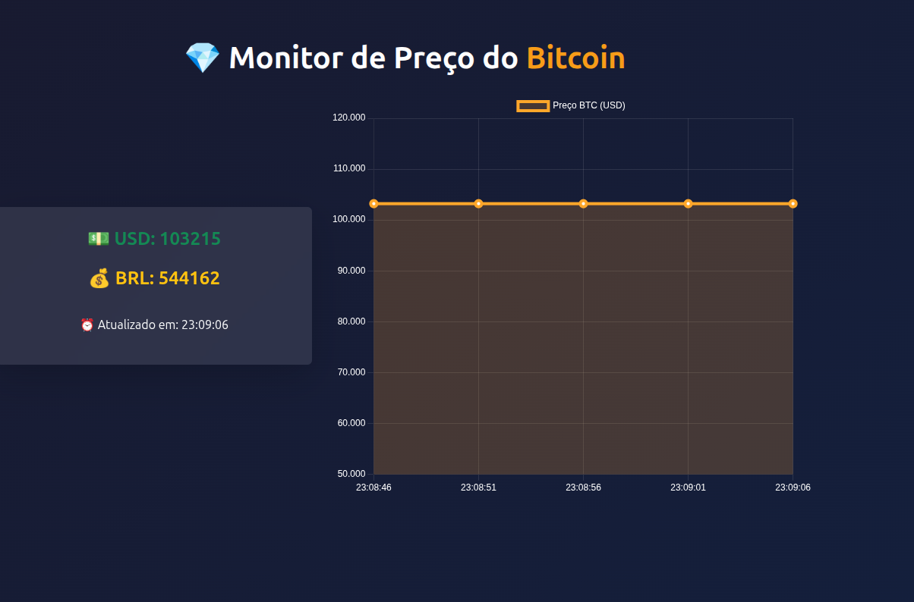

🪙 Monitor de Preço do Bitcoin (Ruby on Rails)
💡 Sobre o Projeto

Este projeto foi desenvolvido como parte prática do aprendizado em Ruby on Rails, com o objetivo de criar um monitor em tempo real do preço do Bitcoin.
A aplicação consome dados de uma API pública (CoinGecko) e exibe os valores em USD e BRL, atualizando automaticamente a cada 5 segundos.

🚀 Tecnologias Utilizadas

Ruby 3.2.2

Ruby on Rails 8.1.1

Bootstrap 5.3

Chart.js

HTTParty

JSON API (CoinGecko)

⚙️ Funcionalidades

✅ Consulta o preço atual do Bitcoin em tempo real
✅ Exibição dos valores em USD e BRL
✅ Atualização automática a cada 5 segundos (sem recarregar a página)
✅ Gráfico dinâmico com variação dos preços
✅ Interface moderna com Bootstrap

🧱 Estrutura do Projeto
monitor_bitcoin/
│
├── app/
│   ├── controllers/
│   │   └── bitcoins_controller.rb
│   ├── models/
│   │   └── bitcoin.rb
│   └── views/
│       └── bitcoins/
│           └── index.html.erb
│
├── config/
│   └── routes.rb
│
├── Gemfile
└── README.md

💾 Como Executar o Projeto

1️⃣ Clone o repositório:

git clone https://github.com/MoiRaibolt/monitor_bitcoin.git

2️⃣ Acesse o diretório:

cd monitor_bitcoin

3️⃣ Instale as dependências:

bundle install

4️⃣ Inicie o servidor:

rails server

5️⃣ Acesse no navegador:
👉 http://localhost:3000

🧠 Estrutura MVC aplicada

Model (bitcoin.rb) → Faz a requisição HTTP à API e processa os dados.

Controller (bitcoins_controller.rb) → Controla as ações da página e retorna JSON quando solicitado.

View (index.html.erb) → Interface dinâmica com gráfico e atualização automática.

📊 Exemplo do funcionamento

A aplicação exibe:

💎 Monitor de Preço do Bitcoin
💵 USD: 67.152,32
💰 BRL: 375.890,45
⏰ Atualizado em: 21:45:10

E mostra um gráfico de linha com a variação em tempo real dos preços BTC/USD.

🎨 Interface Visual

A interface utiliza Bootstrap 5 para o layout e Chart.js para os gráficos.
As atualizações são feitas com JavaScript (Fetch API), sem recarregar a página.

🧩 Possíveis Melhorias Futuras

Histórico de preços armazenado em banco de dados

Comparação com outras criptomoedas

Alertas personalizados de variação de preço

Dashboard com login de usuário

🧑‍💻 Autor

Moisés Raibolt
Desenvolvedor em formação | Ruby on Rails, Python, Front-end e Back-end
📎 LinkedIn

📧 moises.raibolt@gmail.com

🏁 Licença

Este projeto é de uso livre para fins de estudo e aprendizado.
